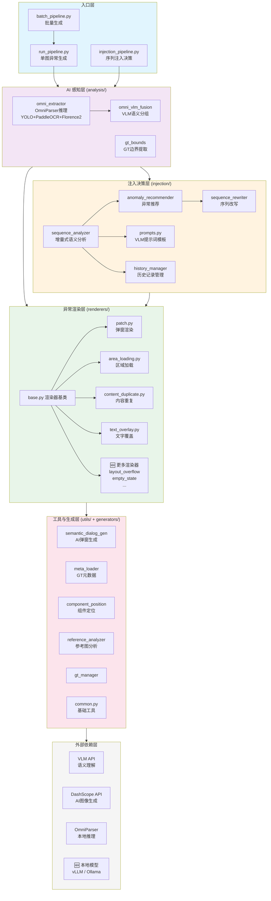

# 实现计划：异常注入决策模块

**创建日期**: 2026-03-06
**最后更新**: 2026-03-26
**状态**: 🔧 持续迭代中
**设计文档**: [2026-03-06-anomaly-injection-decision-design.md](./2026-03-06-anomaly-injection-decision-design.md)

---

## 一、系统架构总览

### 模块关联框图

```
┌─────────────────────────────────────────────────────────────────────────────┐
│                          App_Test_Agent 异常测试平台                         │
├─────────────────────────────────────────────────────────────────────────────┤
│                                                                             │
│  ┌───────────────────────────────────────────────────────────────────────┐  │
│  │                       入口层 (Entry Points)                           │  │
│  │  ┌──────────────┐  ┌──────────────────┐  ┌────────────────────────┐  │  │
│  │  │run_pipeline  │  │injection_pipeline│  │  batch_pipeline        │  │  │
│  │  │(单图异常生成) │  │(序列注入决策)    │  │  (批量生成)            │  │  │
│  │  └──────┬───────┘  └────────┬─────────┘  └───────────┬────────────┘  │  │
│  └─────────┼───────────────────┼────────────────────────┼───────────────┘  │
│            │                   │                        │                   │
│  ┌─────────▼───────────────────▼────────────────────────▼───────────────┐  │
│  │                    AI 感知层 (analysis/)                              │  │
│  │  ┌──────────────────┐  ┌──────────────────┐  ┌──────────────────┐   │  │
│  │  │ omni_extractor   │→│ omni_vlm_fusion  │  │  gt_bounds       │   │  │
│  │  │ (OmniParser推理) │  │ (VLM语义分组)    │  │  (GT边界提取)    │   │  │
│  │  │ YOLO+PaddleOCR   │  │ 过滤/合并/分组   │  │                  │   │  │
│  │  │ +Florence2       │  │                  │  │                  │   │  │
│  │  └──────────────────┘  └──────────────────┘  └──────────────────┘   │  │
│  └──────────────────────────────┬───────────────────────────────────────┘  │
│                                 │ UI-JSON                                  │
│  ┌──────────────────────────────▼───────────────────────────────────────┐  │
│  │                   注入决策层 (injection/)                             │  │
│  │  ┌──────────────────┐  ┌──────────────────┐  ┌──────────────────┐   │  │
│  │  │sequence_analyzer │→│anomaly_recommender│→│sequence_rewriter │   │  │
│  │  │(增量式语义分析)  │  │(异常推荐)        │  │(序列改写)        │   │  │
│  │  └────────┬─────────┘  └────────┬─────────┘  └──────────────────┘   │  │
│  │           │                     │                                    │  │
│  │  ┌────────▼─────────┐  ┌───────▼──────────┐                        │  │
│  │  │   prompts.py     │  │ history_manager  │                        │  │
│  │  │ (VLM提示词模板)  │  │ (历史记录管理)   │                        │  │
│  │  └──────────────────┘  └──────────────────┘                        │  │
│  └──────────────────────────────┬───────────────────────────────────────┘  │
│                                 │                                          │
│  ┌──────────────────────────────▼───────────────────────────────────────┐  │
│  │                   异常渲染层 (renderers/)                            │  │
│  │  ┌──────────┐ ┌──────────────┐ ┌─────────────────┐ ┌─────────────┐ │  │
│  │  │ patch    │ │area_loading  │ │content_duplicate│ │text_overlay │ │  │
│  │  │(弹窗渲染)│ │(区域加载)    │ │(内容重复)       │ │(文字覆盖)   │ │  │
│  │  └────┬─────┘ └──────────────┘ └─────────────────┘ └─────────────┘ │  │
│  │       │          ↑ 继承 base.py (渲染器基类)                        │  │
│  └───────┼──────────────────────────────────────────────────────────────┘  │
│          │                                                                 │
│  ┌───────▼──────────────────────────────────────────────────────────────┐  │
│  │                   工具与生成层 (utils/ + generators/)                │  │
│  │  ┌───────────────────────┐  ┌──────────────────────────────────┐    │  │
│  │  │ semantic_dialog_gen   │  │ meta_loader / gt_manager         │    │  │
│  │  │ (AI弹窗生成)         │  │ (GT模板管理)                     │    │  │
│  │  ├───────────────────────┤  ├──────────────────────────────────┤    │  │
│  │  │ component_position    │  │ reference_analyzer               │    │  │
│  │  │ (组件定位)            │  │ (参考图分析)                     │    │  │
│  │  ├───────────────────────┤  ├──────────────────────────────────┤    │  │
│  │  │ anomaly_sample_mgr   │  │ common.py (基础工具)             │    │  │
│  │  └───────────────────────┘  └──────────────────────────────────┘    │  │
│  └─────────────────────────────────────────────────────────────────────┘  │
│                                                                            │
│  ┌─────────────────────────────────────────────────────────────────────┐  │
│  │                   外部依赖层                                        │  │
│  │  ┌──────────────┐  ┌──────────────┐  ┌───────────────────────┐     │  │
│  │  │ VLM API      │  │ DashScope API│  │ OmniParser (本地)     │     │  │
│  │  │ (语义理解)   │  │ (AI图像生成) │  │ YOLO+PaddleOCR+Flor. │     │  │
│  │  └──────────────┘  └──────────────┘  └───────────────────────┘     │  │
│  └─────────────────────────────────────────────────────────────────────┘  │
└─────────────────────────────────────────────────────────────────────────────┘
```

> 可视化代码见本文档末尾附录：[Mermaid 框图](#附录可视化框图代码)、[Python 生成脚本](#附录python-可视化脚本)

---

## 二、实现阶段

### Phase 1: 基础设施与工具函数

- [x] 1.1 `scripts/injection/__init__.py` - 模块初始化
- [x] 1.2 `scripts/injection/prompts.py` - VLM 提示词模板（初版）
- [x] 1.3 `scripts/utils/history_manager.py` - 历史记录管理器
- [x] 1.4 `examples/injection_demo/` - 示例输入数据
- [ ] 1.5 提示词模板迭代优化（见 [Phase 9](#phase-9-提示词工程优化)）

### Phase 2: 异常推荐器

- [x] 2.1 `scripts/injection/anomaly_recommender.py` - 主类
- [x] 2.2 集成 `utils/meta_loader.py`
- [x] 2.3 实现 `get_categories_description()`
- [ ] 2.4 支持动态异常类别注册（为模式扩展预留）
- [ ] 2.5 推荐置信度评分机制

### Phase 3: 增量式语义分析器

- [x] 3.1 `scripts/injection/sequence_analyzer.py` - 主类
- [x] 3.2 实现 `analyze_step()`
- [x] 3.3 实现 `_build_vlm_prompt()`
- [x] 3.4 实现 `_parse_vlm_response()`
- [x] 3.5 实现 `run()`
- [ ] 3.6 多模型 ensemble 决策支持
- [ ] 3.7 分析结果质量评估与置信度打分

### Phase 4: 序列改写器

- [x] 4.1 `scripts/injection/sequence_rewriter.py` - 主类
- [x] 4.2 实现 `_call_generator()`
- [x] 4.3 实现 `rewrite()`
- [x] 4.4 保存 metadata 和 decision_log
- [ ] 4.5 多点注入支持（单序列多个异常注入）
- [ ] 4.6 注入后续状态模拟（异常恢复路径生成）

### Phase 5: 主入口与交互

- [x] 5.1 `scripts/injection_pipeline.py` - 主入口
- [x] 5.2 实现参数解析
- [x] 5.3 实现用户确认流程
- [x] 5.4 实现完整流水线串联
- [ ] 5.5 批量序列注入支持
- [ ] 5.6 结果评估报告自动生成

### Phase 6: 测试与文档

- [x] 6.1 示例数据目录结构已创建
- [ ] 6.2 端到端测试（需要实际截图数据）
- [ ] 6.3 单元测试覆盖核心模块
- [ ] 6.4 更新 README 和使用文档

### Phase 7: 异常模式扩展与挖掘 🆕

> 当前主流水线已支持基础四种模式及 `modify_text*` 文字编辑路径；相对真实业务异常仍显不足。本阶段目标是系统性扩展异常模式库与注入策略。

#### 7.1 已有模式梳理

| 编号 | 模式 | 渲染器 | 覆盖场景 |
|------|------|--------|---------|
| 1 | dialog（弹窗覆盖） | `renderers/patch.py` | 广告弹窗、系统提示、权限请求 |
| 2 | area_loading（区域加载） | `renderers/area_loading.py` | 加载超时、网络错误、骨架屏 |
| 3 | content_duplicate（内容重复） | `renderers/content_duplicate.py` | 列表重复、数据冗余 |
| 4 | text_overlay（文字覆盖） | `renderers/text_overlay.py` | 文字遮挡、信息混乱 |

#### 7.2 待扩展异常模式（参考方案）

基于移动端 APP 测试中常见的异常 UI 表现，规划以下待扩展模式：

| 编号 | 新模式 | 描述 | 优先级 | 参考来源 |
|------|--------|------|--------|---------|
| 5 | **layout_overflow**（布局溢出） | 文字截断、元素超出容器边界、长文本未自适应 | 🔥 高 | 真实 bug 高频类型 |
| 6 | **element_misalignment**（元素错位） | 按钮偏移、图标不对齐、层级错乱 | 🔥 高 | UI 回归测试常见 |
| 7 | **empty_state**（空状态/空白页） | 数据为空时无占位提示、白屏 | 🔥 高 | 边界条件 |
| 8 | **toast_notification**（Toast 提示） | 错误 toast、重叠 toast、遮挡关键操作区 | ⭐ 中 | 用户体验异常 |
| 9 | **keyboard_overlay**（键盘遮挡） | 软键盘弹出遮挡输入框或按钮 | ⭐ 中 | 移动端特有 |
| 10 | **image_broken**（图片加载失败） | 图片 placeholder、裂图、尺寸异常 | ⭐ 中 | 网络异常场景 |
| 11 | **permission_dialog**（权限弹窗） | 系统级权限请求、定位/相机/通知权限 | ⭐ 中 | 系统交互 |
| 12 | **navigation_error**（导航异常） | 页面跳转错误、返回栈异常、深层链接失效 | 💡 探索 | 需与操作序列结合 |
| 13 | **partial_render**（局部渲染异常） | 部分区域未渲染、闪烁、渐进式加载中间态 | 💡 探索 | 渲染引擎问题 |
| 14 | **language_mismatch**（语言混乱） | 多语言混排、翻译缺失、RTL 布局异常 | 💡 探索 | 国际化场景 |

#### 7.3 模式挖掘策略

**策略 A：与达尔文实验室合作挖掘**

基于达尔文实验室已有的异常遍历能力，系统性探索更多异常情况：

1. **数据采集协同**：利用达尔文实验室的自动化遍历框架，对主流 APP 执行大规模 UI 遍历，自动采集异常截图
2. **异常分类标注**：对采集的异常截图进行 VLM 辅助分类，建立异常模式分类体系
3. **模式归纳**：从大量标注数据中归纳新的异常模式类别，补充到渲染器库
4. **闭环验证**：生成的异常截图回注到达尔文遍历流程中，验证 Agent 对异常的检测与处理能力

```
达尔文自动遍历 → 异常截图采集 → VLM分类标注 → 模式归纳 → 新渲染器开发 → 回注验证
      ↑                                                              │
      └──────────────────── 闭环反馈 ←──────────────────────────────┘
```

**策略 B：基于真实 Bug 库挖掘**

1. 从公司内部 Bug 系统（Jira / Tapd 等）中提取 UI 类 bug 截图
2. 对 bug 截图进行聚类分析，发现高频异常模式
3. 针对高频模式开发对应渲染器

**策略 C：基于竞品分析挖掘**

1. 分析主流 APP 测试工具（如 Appium、Maestro、Detox）的异常检测维度
2. 参考学术界 UI 异常检测论文（如 UIED、Screen2Vec）的异常分类
3. 综合形成完整的异常模式体系

#### 7.4 实施任务

- [ ] 7.4.1 完成异常模式分类体系文档
- [ ] 7.4.2 与达尔文实验室对接数据采集接口
- [ ] 7.4.3 开发 `layout_overflow` 渲染器
- [ ] 7.4.4 开发 `element_misalignment` 渲染器
- [ ] 7.4.5 开发 `empty_state` 渲染器
- [ ] 7.4.6 建立异常模式评估基准（benchmark）
- [ ] 7.4.7 渲染器插件化框架（支持快速新增模式）

### Phase 8: 工程化部署 🆕

> 当前系统依赖远程 API 调用（VLM API、DashScope API），未实现本地化部署，也未为高校合作预留接口。本阶段聚焦工程化落地。

#### 8.1 本地化部署

当前痛点：所有 AI 推理（语义理解、图像生成）均依赖远程 API，存在以下问题：
- **数据安全**：截图数据需上传至第三方服务
- **网络依赖**：离线环境无法运行
- **成本控制**：大批量生成 API 调用费用高
- **延迟**：网络延迟影响批量处理效率

实施计划：

| 任务 | 描述 | 方案 |
|------|------|------|
| VLM 本地化 | 语义理解模型本地部署 | Qwen-VL / InternVL 本地推理，兼容 OpenAI API 格式 |
| 图像生成本地化 | 弹窗素材生成本地化 | Stable Diffusion / SDXL 本地部署替代 DashScope |
| OmniParser 优化 | 已本地部署，优化推理速度 | TensorRT / ONNX Runtime 加速 |
| 统一推理后端 | 提供可切换的推理后端配置 | 抽象 `InferenceBackend` 接口，支持 local / remote 切换 |

```python
# 目标架构：可切换的推理后端
class InferenceBackend(ABC):
    @abstractmethod
    def chat_completion(self, messages, **kwargs) -> str: ...

class RemoteAPIBackend(InferenceBackend):    # 当前实现
    """通过 OpenAI 兼容 API 调用远程模型"""

class LocalModelBackend(InferenceBackend):   # 待实现
    """本地模型推理（vLLM / Ollama / llama.cpp）"""

class HybridBackend(InferenceBackend):       # 待实现
    """混合模式：简单任务本地处理，复杂任务调远程"""
```

- [ ] 8.1.1 抽象 `InferenceBackend` 统一接口
- [ ] 8.1.2 实现 `LocalModelBackend`（支持 vLLM / Ollama）
- [ ] 8.1.3 实现后端切换配置（`config.yaml` 驱动）
- [ ] 8.1.4 本地图像生成替代方案集成
- [ ] 8.1.5 Docker 化部署方案（一键启动所有本地服务）

#### 8.2 高校合作接口预留

为支持高校合作（如与老师的技术实现对接），需要预留标准化的扩展接口：

**核心接口设计**：

```python
# 1. 异常渲染器插件接口 — 高校可开发自定义渲染器
class BaseRenderer(ABC):
    @abstractmethod
    def render(self, screenshot: Image, ui_json: dict, instruction: str) -> Image: ...

    @abstractmethod
    def get_mode_name(self) -> str: ...

# 2. 异常模式注册接口 — 动态注册新的异常类型
class AnomalyRegistry:
    def register_mode(self, mode_name: str, renderer_cls: type, meta: dict): ...
    def list_modes(self) -> List[str]: ...

# 3. 评估接口 — 统一的生成质量评估
class QualityEvaluator(ABC):
    @abstractmethod
    def evaluate(self, original: Image, anomaly: Image, metadata: dict) -> dict: ...

# 4. 数据接口 — 标准化的输入输出格式
class DataAdapter(ABC):
    @abstractmethod
    def load_screenshots(self, source: Any) -> List[Screenshot]: ...
    @abstractmethod
    def export_results(self, results: List[Result], format: str): ...
```

**SDK 化目标**：

```
pip install app-test-agent              # 安装
from app_test_agent import Pipeline     # 导入
pipeline = Pipeline(config="local")     # 本地模式
result = pipeline.run(screenshot, instruction="生成弹窗")  # 一行调用
```

- [ ] 8.2.1 定义渲染器插件规范文档
- [ ] 8.2.2 实现 `AnomalyRegistry` 动态注册机制
- [ ] 8.2.3 定义标准数据输入输出格式（JSON Schema）
- [ ] 8.2.4 编写高校合作开发者指南
- [ ] 8.2.5 提供示例插件项目模板

#### 8.3 部署方案

| 部署形态 | 目标用户 | 方案 |
|---------|---------|------|
| **本地 CLI** | 开发者 / 研究人员 | 当前模式，优化依赖安装 |
| **Docker Compose** | 团队/实验室 | 容器化所有服务（OmniParser + VLM + Pipeline） |
| **REST API 服务** | 高校合作 / 集成 | FastAPI 封装，提供 HTTP 接口 |
| **Web UI** | 非技术用户 | Gradio / Streamlit 可视化界面（后续） |

- [ ] 8.3.1 编写 Dockerfile 和 docker-compose.yml
- [ ] 8.3.2 实现 FastAPI REST 接口封装
- [ ] 8.3.3 编写部署文档（本地 / Docker / 服务化）

### Phase 9: 提示词工程优化 🆕

> VLM 提示词是系统效果的核心杠杆。当前提示词为初版，需要系统性优化以提升决策准确率和生成质量。

#### 9.1 优化维度

| 维度 | 当前状态 | 优化方向 |
|------|---------|---------|
| **注入决策提示词** | 初版，基于 UI-Venus 格式 | 增加 few-shot 示例、思维链引导、决策校准 |
| **语义分组提示词** | Stage 2 VLM 融合 | 优化分组粒度、减少误合并/漏合并 |
| **弹窗生成文案** | VLM 生成广告/提示文案 | 增加风格多样性、匹配 APP 上下文 |
| **异常推荐提示词** | 基础描述 | 加入场景匹配规则、概率校准 |

#### 9.2 优化策略

**A. 基于评估的迭代优化**

```
当前提示词 → 批量测试生成 → 人工/VLM评估 → 识别薄弱环节 → 针对性修改 → 回归测试
```

- 建立评估数据集（≥50 组输入-期望输出对）
- 定义评估指标：决策准确率、异常类型匹配率、生成视觉质量
- 每轮迭代记录提示词版本与评估分数

**B. Few-shot 示例库建设**

- 为每种异常模式准备 2-3 个高质量示例
- 示例覆盖：正确决策、边界情况、常见误判
- 动态示例选择：根据当前截图特征选取最相关的 few-shot

**C. 思维链（CoT）优化**

```
当前：<think>简短分析</think><decision>INJECT/SKIP</decision>
优化：<observe>界面观察</observe>
      <context>上下文关联</context>
      <reason>注入理由/跳过理由</reason>
      <confidence>0.85</confidence>
      <decision>INJECT</decision>
```

**D. 提示词模板管理**

- 版本化管理（`prompts_v1.py`, `prompts_v2.py`）
- A/B 测试框架
- 自动评估 pipeline

#### 9.3 实施任务

- [ ] 9.3.1 建立提示词评估数据集（≥50 组）
- [ ] 9.3.2 实现自动化评估脚本
- [ ] 9.3.3 优化注入决策提示词（增加 few-shot + CoT）
- [ ] 9.3.4 优化语义分组提示词（Stage 2 准确性提升）
- [ ] 9.3.5 优化弹窗文案生成提示词（风格多样性）
- [ ] 9.3.6 建立提示词版本管理与 A/B 测试机制

---

## 三、已创建文件清单

```
ui_semantic_patch/
├── scripts/
│   ├── injection/
│   │   ├── __init__.py              ✅ 模块初始化
│   │   ├── prompts.py               ✅ VLM 提示词模板（初版）
│   │   ├── anomaly_recommender.py   ✅ 异常推荐器
│   │   ├── sequence_analyzer.py     ✅ 增量式语义分析器
│   │   └── sequence_rewriter.py     ✅ 序列改写器
│   ├── injection_pipeline.py        ✅ 主入口脚本
│   └── utils/
│       └── history_manager.py       ✅ 历史记录管理器
└── examples/
    └── injection_demo/
        └── task.json                ✅ 示例任务配置
```

---

## 四、使用方法

```bash
cd ui_semantic_patch/scripts

# 交互式模式
python injection_pipeline.py --input-dir examples/injection_demo --output-dir output/injected

# 非交互式模式
python injection_pipeline.py \
  --input-dir examples/injection_demo \
  --output-dir output/injected \
  --no-interactive
```

---

## 五、进度追踪

| 日期 | 完成项 | 备注 |
|------|--------|------|
| 2026-03-06 | 计划创建 | - |
| 2026-03-06 | Phase 1-5 核心框架搭建 | 基本功能可运行，细节待完善 |
| 2026-03-09 | 计划修订 | 新增 Phase 7/8/9，补充工程化与优化规划 |

---

## 六、后续工作优先级

### 近期（1-2 周）

1. 准备实际测试截图数据，完成端到端测试验证
2. 提示词优化第一轮迭代（Phase 9.3.1 - 9.3.3）
3. 细化各模块的边界条件处理和异常容错

### 中期（1-2 月）

4. 异常模式扩展：开发 3 个高优先级新渲染器（Phase 7.4.3 - 7.4.5）
5. 与达尔文实验室启动数据采集合作（Phase 7.4.2）
6. 抽象推理后端接口，支持本地/远程切换（Phase 8.1.1 - 8.1.3）

### 远期（3-6 月）

7. 完成本地化部署方案（Docker 化 + REST API）
8. 高校合作接口标准化与 SDK 发布
9. 建立异常模式评估基准（benchmark）
10. 渲染器插件化框架，支持社区/高校贡献

---

## 附录：可视化框图代码

### Mermaid 框图

可在任何支持 Mermaid 的 Markdown 渲染器中查看（如 GitHub、Typora、VS Code 插件）：



### Python 可视化脚本

使用 `graphviz` 库生成高质量 PNG/PDF 框图：

```python
"""
模块关联框图生成脚本
Usage: pip install graphviz && python generate_architecture_diagram.py
"""
from graphviz import Digraph


def create_architecture_diagram():
    dot = Digraph(
        "App_Test_Agent_Architecture",
        comment="异常测试平台模块架构",
        format="png",
    )
    dot.attr(rankdir="TB", fontname="Microsoft YaHei", fontsize="12")
    dot.attr("node", shape="box", style="rounded,filled", fontname="Microsoft YaHei", fontsize="10")
    dot.attr("edge", fontname="Microsoft YaHei", fontsize="9")

    # ── 入口层 ──
    with dot.subgraph(name="cluster_entry") as c:
        c.attr(label="入口层 (Entry Points)", style="dashed", color="#1565C0", fontcolor="#1565C0")
        c.node("run_pipeline", "run_pipeline.py\n单图异常生成", fillcolor="#BBDEFB")
        c.node("injection_pipeline", "injection_pipeline.py\n序列注入决策", fillcolor="#BBDEFB")
        c.node("batch_pipeline", "batch_pipeline.py\n批量生成", fillcolor="#BBDEFB")

    # ── AI 感知层 ──
    with dot.subgraph(name="cluster_analysis") as c:
        c.attr(label="AI 感知层 (analysis/)", style="dashed", color="#7B1FA2", fontcolor="#7B1FA2")
        c.node("omni_extractor", "omni_extractor\nOmniParser推理\nYOLO+PaddleOCR+Florence2", fillcolor="#E1BEE7")
        c.node("omni_vlm_fusion", "omni_vlm_fusion\nVLM语义分组", fillcolor="#E1BEE7")
        c.node("gt_bounds", "gt_bounds\nGT边界提取", fillcolor="#E1BEE7")

    # ── 注入决策层 ──
    with dot.subgraph(name="cluster_injection") as c:
        c.attr(label="注入决策层 (injection/)", style="dashed", color="#E65100", fontcolor="#E65100")
        c.node("sequence_analyzer", "sequence_analyzer\n增量式语义分析", fillcolor="#FFE0B2")
        c.node("anomaly_recommender", "anomaly_recommender\n异常推荐", fillcolor="#FFE0B2")
        c.node("sequence_rewriter", "sequence_rewriter\n序列改写", fillcolor="#FFE0B2")
        c.node("prompts", "prompts.py\nVLM提示词模板", fillcolor="#FFF3E0")
        c.node("history_manager", "history_manager\n历史记录管理", fillcolor="#FFF3E0")

    # ── 异常渲染层 ──
    with dot.subgraph(name="cluster_renderers") as c:
        c.attr(label="异常渲染层 (renderers/)", style="dashed", color="#2E7D32", fontcolor="#2E7D32")
        c.node("base_renderer", "base.py\n渲染器基类", fillcolor="#C8E6C9")
        c.node("patch", "patch.py\n弹窗渲染", fillcolor="#C8E6C9")
        c.node("area_loading", "area_loading.py\n区域加载", fillcolor="#C8E6C9")
        c.node("content_duplicate", "content_duplicate.py\n内容重复", fillcolor="#C8E6C9")
        c.node("text_overlay", "text_overlay.py\n文字覆盖", fillcolor="#C8E6C9")
        c.node("new_renderers", "🆕 待扩展\nlayout_overflow\nempty_state\n...", fillcolor="#A5D6A7", style="rounded,filled,dashed")

    # ── 工具与生成层 ──
    with dot.subgraph(name="cluster_utils") as c:
        c.attr(label="工具与生成层 (utils/ + generators/)", style="dashed", color="#C62828", fontcolor="#C62828")
        c.node("semantic_dialog_gen", "semantic_dialog_gen\nAI弹窗生成", fillcolor="#FFCDD2")
        c.node("meta_loader", "meta_loader\nGT元数据加载", fillcolor="#FFCDD2")
        c.node("component_position", "component_position\n组件定位", fillcolor="#FFCDD2")
        c.node("common", "common.py\n基础工具", fillcolor="#FFCDD2")

    # ── 外部依赖层 ──
    with dot.subgraph(name="cluster_external") as c:
        c.attr(label="外部依赖层", style="dashed", color="#616161", fontcolor="#616161")
        c.node("vlm_api", "VLM API\n语义理解", fillcolor="#E0E0E0")
        c.node("dashscope_api", "DashScope API\nAI图像生成", fillcolor="#E0E0E0")
        c.node("omniparser", "OmniParser\n本地推理", fillcolor="#E0E0E0")
        c.node("local_model", "🆕 本地模型\nvLLM / Ollama", fillcolor="#EEEEEE", style="rounded,filled,dashed")

    # ── 连线 ──
    # 入口层 → 感知层
    dot.edge("run_pipeline", "omni_extractor", label="Stage 1")
    dot.edge("injection_pipeline", "omni_extractor")
    dot.edge("batch_pipeline", "run_pipeline", label="批量调用")

    # 感知层内部
    dot.edge("omni_extractor", "omni_vlm_fusion", label="Stage 2")

    # 感知层 → 注入决策层
    dot.edge("omni_vlm_fusion", "sequence_analyzer", label="UI-JSON")
    dot.edge("injection_pipeline", "sequence_analyzer")

    # 注入决策层内部
    dot.edge("sequence_analyzer", "anomaly_recommender")
    dot.edge("anomaly_recommender", "sequence_rewriter")
    dot.edge("sequence_analyzer", "prompts")
    dot.edge("sequence_analyzer", "history_manager")

    # → 渲染层
    dot.edge("run_pipeline", "patch", label="Stage 3")
    dot.edge("run_pipeline", "area_loading")
    dot.edge("run_pipeline", "content_duplicate")
    dot.edge("run_pipeline", "text_overlay")
    dot.edge("sequence_rewriter", "run_pipeline", label="调用生成器")
    dot.edge("base_renderer", "patch", style="dashed", arrowhead="empty")
    dot.edge("base_renderer", "area_loading", style="dashed", arrowhead="empty")
    dot.edge("base_renderer", "content_duplicate", style="dashed", arrowhead="empty")
    dot.edge("base_renderer", "text_overlay", style="dashed", arrowhead="empty")
    dot.edge("base_renderer", "new_renderers", style="dashed", arrowhead="empty")

    # 渲染层 → 工具层
    dot.edge("patch", "semantic_dialog_gen")
    dot.edge("patch", "component_position")
    dot.edge("anomaly_recommender", "meta_loader")

    # 工具层 → 外部依赖
    dot.edge("omni_vlm_fusion", "vlm_api")
    dot.edge("sequence_analyzer", "vlm_api")
    dot.edge("semantic_dialog_gen", "dashscope_api")
    dot.edge("omni_extractor", "omniparser")
    dot.edge("vlm_api", "local_model", style="dashed", label="未来替换")

    return dot


if __name__ == "__main__":
    diagram = create_architecture_diagram()
    output_path = diagram.render("architecture_diagram", cleanup=True)
    print(f"框图已生成: {output_path}")
```

> **使用方式**：
> ```bash
> pip install graphviz
> python generate_architecture_diagram.py
> ```
> 生成 `architecture_diagram.png` 文件。

---

**创建日期**: 2026-03-06
**最后更新**: 2026-03-26
**文档同步**: 环境与 `run_pipeline` 入口以仓库根目录 [Claude.md](../../Claude.md) 为准。
**版本**: v2.0 — 补充工程化部署、模式扩展、提示词优化规划
