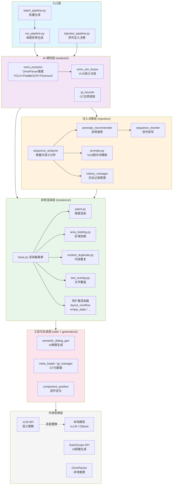

# 异常界面构建（UI Semantic Patch）项目计划书

> **文档类型**: 项目计划书
> **启动日期**: 2026-01-09
> **最后更新**: 2026-03-09
> **项目状态**: Phase 2 核心框架基本搭建完成，持续完善中；Phase 3-5 规划中
> **版本**: v2.0

---

## 1. 项目概述

### 1.1 项目背景

当前 AI 智能体测试面临一个核心痛点：**异常场景覆盖能力极度匮乏**。传统测试主要依赖人工构造异常截图或手动触发异常状态，效率低、覆盖面窄、无法规模化。

本项目作为「异常测试场景生成平台」三阶段架构（正常行为采集 → 程序化异常生成 → 动态场景注入）中 **第二阶段的核心原型**，专注于解决"如何基于正常 UI 截图自动、受控地生成高仿真异常场景"这一关键问题。

### 1.2 项目定位

**UI Semantic Patch** 是一个 UI 异常场景自动生成框架，采用 **"逻辑层修改 + 物理层绘制"** 的解耦架构：

- **VLM 充当 UI 设计师** → 输出修改指令（JSON Patch 语义）
- **渲染引擎充当绘图员** → 执行像素级受控修改

相比端到端图像生成（如 Diffusion 全图重绘），本方案在文字清晰度、可控性、效率和一致性上具有显著优势。

### 1.3 核心技术路线

```
OmniParser 精确检测 → VLM 语义过滤 → 模式专用渲染器
      (Stage 1)          (Stage 2)        (Stage 3)
```

| 阶段    | 技术                         | 职责                               |
| ------- | ---------------------------- | ---------------------------------- |
| Stage 1 | YOLO + PaddleOCR + Florence2 | 像素级 UI 边界检测                 |
| Stage 2 | VLM (qwen-vl-max / gpt-4o)   | 语义过滤、噪声清理、组件合并       |
| Stage 3 | PIL + DashScope AI + VLM     | 异常场景渲染（弹窗 / 加载 / 重复） |

---

## 2. 系统架构

### 2.1 模块关联框图

```
┌─────────────────────────────────────────────────────────────────────────────┐
│                          App_Test_Agent 异常测试平台                         │
├─────────────────────────────────────────────────────────────────────────────┤
│                                                                             │
│  ┌───────────────────────────────────────────────────────────────────────┐  │
│  │                       入口层 (Entry Points)                           │  │
│  │  ┌──────────────┐  ┌──────────────────┐  ┌────────────────────────┐  │  │
│  │  │run_pipeline  │  │injection_pipeline│  │  batch_pipeline        │  │  │
│  │  │(单图异常生成) │  │(序列注入决策)    │  │  (批量生成)            │  │  │
│  │  └──────┬───────┘  └────────┬─────────┘  └───────────┬────────────┘  │  │
│  └─────────┼───────────────────┼────────────────────────┼───────────────┘  │
│            │                   │                        │                   │
│  ┌─────────▼───────────────────▼────────────────────────▼───────────────┐  │
│  │                    AI 感知层 (analysis/)                              │  │
│  │  ┌──────────────────┐  ┌──────────────────┐  ┌──────────────────┐   │  │
│  │  │ omni_extractor   │→│ omni_vlm_fusion  │  │  gt_bounds       │   │  │
│  │  │ (OmniParser推理) │  │ (VLM语义分组)    │  │  (GT边界提取)    │   │  │
│  │  │ YOLO+PaddleOCR   │  │ 过滤/合并/分组   │  │                  │   │  │
│  │  │ +Florence2       │  │                  │  │                  │   │  │
│  │  └──────────────────┘  └──────────────────┘  └──────────────────┘   │  │
│  └──────────────────────────────┬───────────────────────────────────────┘  │
│                                 │ UI-JSON                                  │
│  ┌──────────────────────────────▼───────────────────────────────────────┐  │
│  │                   注入决策层 (injection/)                             │  │
│  │  ┌──────────────────┐  ┌──────────────────┐  ┌──────────────────┐   │  │
│  │  │sequence_analyzer │→│anomaly_recommender│→│sequence_rewriter │   │  │
│  │  │(增量式语义分析)  │  │(异常推荐)        │  │(序列改写)        │   │  │
│  │  └────────┬─────────┘  └────────┬─────────┘  └──────────────────┘   │  │
│  │           │                     │                                    │  │
│  │  ┌────────▼─────────┐  ┌───────▼──────────┐                        │  │
│  │  │   prompts.py     │  │ history_manager  │                        │  │
│  │  │ (VLM提示词模板)  │  │ (历史记录管理)   │                        │  │
│  │  └──────────────────┘  └──────────────────┘                        │  │
│  └──────────────────────────────┬───────────────────────────────────────┘  │
│                                 │                                          │
│  ┌──────────────────────────────▼───────────────────────────────────────┐  │
│  │                   异常渲染层 (renderers/)                            │  │
│  │  ┌──────────┐ ┌──────────────┐ ┌─────────────────┐ ┌─────────────┐ │  │
│  │  │ patch    │ │area_loading  │ │content_duplicate│ │text_overlay │ │  │
│  │  │(弹窗渲染)│ │(区域加载)    │ │(内容重复)       │ │(文字覆盖)   │ │  │
│  │  └────┬─────┘ └──────────────┘ └─────────────────┘ └─────────────┘ │  │
│  │       │          ↑ 继承 base.py (渲染器基类)                        │  │
│  │       │       ┌─────────────────────────────────────────────┐       │  │
│  │       │       │ 🆕 待扩展: layout_overflow / empty_state   │       │  │
│  │       │       │    / toast / keyboard_overlay / ...         │       │  │
│  │       │       └─────────────────────────────────────────────┘       │  │
│  └───────┼──────────────────────────────────────────────────────────────┘  │
│          │                                                                 │
│  ┌───────▼──────────────────────────────────────────────────────────────┐  │
│  │                   工具与生成层 (utils/ + generators/)                │  │
│  │  ┌───────────────────────┐  ┌──────────────────────────────────┐    │  │
│  │  │ semantic_dialog_gen   │  │ meta_loader / gt_manager         │    │  │
│  │  │ (AI弹窗生成)         │  │ (GT模板管理)                     │    │  │
│  │  ├───────────────────────┤  ├──────────────────────────────────┤    │  │
│  │  │ component_position    │  │ reference_analyzer               │    │  │
│  │  │ (组件定位)            │  │ (参考图分析)                     │    │  │
│  │  ├───────────────────────┤  ├──────────────────────────────────┤    │  │
│  │  │ anomaly_sample_mgr   │  │ common.py (基础工具)             │    │  │
│  │  └───────────────────────┘  └──────────────────────────────────┘    │  │
│  └─────────────────────────────────────────────────────────────────────┘  │
│                                                                            │
│  ┌─────────────────────────────────────────────────────────────────────┐  │
│  │                   外部依赖层                                        │  │
│  │  ┌──────────────┐  ┌──────────────┐  ┌───────────────────────┐     │  │
│  │  │ VLM API      │  │ DashScope API│  │ OmniParser (本地)     │     │  │
│  │  │ (语义理解)   │  │ (AI图像生成) │  │ YOLO+PaddleOCR+Flor. │     │  │
│  │  └──────┬───────┘  └──────────────┘  └───────────────────────┘     │  │
│  │         │                                                           │  │
│  │  ┌──────▼───────────────────────────────────────────────┐          │  │
│  │  │ 🆕 本地化替代: vLLM / Ollama / Stable Diffusion     │          │  │
│  │  └──────────────────────────────────────────────────────┘          │  │
│  └─────────────────────────────────────────────────────────────────────┘  │
└─────────────────────────────────────────────────────────────────────────────┘
```

### 2.2 数据流

```
原始截图
   │
   ▼
[Stage 1] OmniParser 粗检测 ──→ *_stage1_omni_raw_*.json (原始UI组件, ~57个)
   │
   ▼
[Stage 2] VLM 语义分组 ──→ *_stage2_filtered_*.json (清理后UI-JSON, ~13个)
   │
   ├──→ [单图模式] run_pipeline.py ──→ [Stage 3] 异常渲染 ──→ *_final_*.png
   │
   └──→ [序列模式] injection_pipeline.py
           │
           ├── 增量式语义分析 (逐步决策注入点)
           ├── 异常推荐 (读取GT模板库)
           ├── 用户确认 (可选)
           ├── 调用 run_pipeline.py 生成异常截图
           └── 序列改写 ──→ 改写后截图序列 + decision_log.json
```

### 2.3 模块职责表

| 层级 | 模块 | 职责 |
|------|------|------|
| **入口** | `run_pipeline.py` | 三阶段串联，单图异常生成入口 |
| | `batch_pipeline.py` | 批量执行（原图 × GT 笛卡尔积） |
| | `injection_pipeline.py` | 注入决策流水线（操作序列分析） |
| **AI 感知** | `analysis/omni_extractor.py` | OmniParser 本地推理 |
| | `analysis/omni_vlm_fusion.py` | VLM 语义分组 |
| | `analysis/gt_bounds.py` | GT 边界框提取 |
| | `analysis/visualize.py` | 检测结果可视化 |
| **异常渲染** | `renderers/base.py` | 渲染器基类 |
| | `renderers/patch.py` | dialog 弹窗渲染 |
| | `renderers/area_loading.py` | 区域加载异常 |
| | `renderers/content_duplicate.py` | 内容重复 |
| | `renderers/text_overlay.py` | 文字覆盖 |
| **注入决策** | `injection/sequence_analyzer.py` | 操作序列语义分析（借鉴 UI-Venus） |
| | `injection/anomaly_recommender.py` | 异常推荐决策 |
| | `injection/sequence_rewriter.py` | 序列改写 |
| | `injection/prompts.py` | VLM 提示词模板 |
| **元数据** | `generators/meta.py` | meta.json 自动生成 |
| | `generators/filename_descriptions.py` | 文件名描述生成 |
| **工具库** | `utils/common.py` | 图片编码、JSON 提取 |
| | `utils/meta_loader.py` | GT 元数据加载 |
| | `utils/component_position_resolver.py` | 组件定位 |
| | `utils/semantic_dialog_generator.py` | 弹窗生成器 |
| | `utils/history_manager.py` | 历史记录管理（借鉴 UI-Venus） |

---

## 3. 阶段目标

### Phase 1：基础流水线搭建 ✅

**目标**: 打通从截图输入到异常截图输出的最小可行流水线

| 序号 | 目标项          | 验收标准                         |
| ---- | --------------- | -------------------------------- |
| P1-1 | 项目骨架搭建    | 目录结构、依赖管理、环境配置完成 |
| P1-2 | VLM 结构提取    | 输入截图，输出结构化 UI-JSON     |
| P1-3 | 文本局部重绘    | 能够对指定区域进行文字替换       |
| P1-4 | 基础 Patch 生成 | VLM 能输出合理的修改指令         |
| P1-5 | 一键执行流程    | 单条命令完成端到端生成           |

### Phase 2：多模式渲染与工具链建设（核心框架基本搭建，细节持续完善中）

**目标**: 支持多种异常模式、引入 GT 模板驱动、构建完整辅助工具链

| 序号  | 目标项                | 验收标准                                                 | 状态 |
| ----- | --------------------- | -------------------------------------------------------- | ---- |
| P2-1  | OmniParser + VLM 融合 | 检测精度显著优于纯 VLM 提取，组件从 57 个精简至 ~13 个   | ✅ |
| P2-2  | 语义感知弹窗生成      | 自动识别 7 大页面类型，生成语义匹配的弹窗内容            | ✅ |
| P2-3  | 参考图片风格学习      | 从参考图提取位置、尺寸、按钮、阴影等 5 维风格特征        | ✅ |
| P2-4  | AI 图像生成模式       | DashScope 生成高保真弹窗，PIL 作为回退                   | ✅ |
| P2-5  | GT 模板驱动生成       | meta.json 控制生成参数，优先级：GT > AI > PIL            | ✅ |
| P2-6  | 内容重复异常模式      | content_duplicate 渲染器完成，支持底部浮层扩展           | ✅ |
| P2-7  | 区域加载异常模式      | area_loading 渲染器完成，支持参考图标风格迁移            | ✅ |
| P2-8  | 文字覆盖编辑模式      | text_overlay 渲染器完成，支持局部编辑操作                | ✅ |
| P2-9  | 批量生成流水线        | 原图 × GT 样本笛卡尔积批量生成 + 汇总报告                | ✅ |
| P2-10 | 辅助工具链            | meta 自动生成、边界框提取、风格迁移、样本管理等 6 个工具 | ✅ |
| P2-11 | 数据集建设            | 原图 4 类 6 张 + GT 模板 3 类 10 个样本                  | ✅ |
| P2-12 | 一键启动脚本          | launch.sh / launch.bat 交互式菜单与命令行模式            | ✅ |
| P2-13 | 端到端测试验证        | 使用实际截图数据验证全流程                               | ⏳ 待验证 |
| P2-14 | 注入决策流水线细节完善 | 多点注入、置信度评分、批量序列注入等                     | ⏳ 待完善 |

**Phase 2 遗留项**:

| 序号  | 目标项                          | 状态   |
| ----- | ------------------------------- | ------ |
| P2-R1 | 组件库积累（弹窗、Toast 模板）  | 待开展 |
| P2-R2 | 高级 Inpainting（复杂背景修复） | 待开展 |
| P2-R3 | 注入决策推荐置信度打分机制      | 待开展 |
| P2-R4 | 多模型 ensemble 决策支持        | 待开展 |

### Phase 3：异常模式扩展与挖掘

**目标**: 系统性扩展异常模式库，从当前 4 种模式大幅增加覆盖面

> **核心问题**: 当前仅支持 dialog / area_loading / content_duplicate / text_overlay 四种异常模式，远不能覆盖真实场景的异常多样性。

#### 3.1 已有模式梳理

| 编号 | 模式 | 渲染器 | 覆盖场景 |
|------|------|--------|---------|
| 1 | dialog（弹窗覆盖） | `renderers/patch.py` | 广告弹窗、系统提示、权限请求 |
| 2 | area_loading（区域加载） | `renderers/area_loading.py` | 加载超时、网络错误、骨架屏 |
| 3 | content_duplicate（内容重复） | `renderers/content_duplicate.py` | 列表重复、数据冗余 |
| 4 | text_overlay（文字覆盖） | `renderers/text_overlay.py` | 文字遮挡、信息混乱 |

#### 3.2 待扩展异常模式

基于移动端 APP 测试中常见的异常 UI 表现，规划以下待扩展模式：

| 编号 | 新模式 | 描述 | 优先级 |
|------|--------|------|--------|
| 5 | **layout_overflow**（布局溢出） | 文字截断、元素超出容器边界、长文本未自适应 | 🔥 高 |
| 6 | **element_misalignment**（元素错位） | 按钮偏移、图标不对齐、层级错乱 | 🔥 高 |
| 7 | **empty_state**（空状态/空白页） | 数据为空时无占位提示、白屏 | 🔥 高 |
| 8 | **toast_notification**（Toast 提示） | 错误 toast、重叠 toast、遮挡关键操作区 | ⭐ 中 |
| 9 | **keyboard_overlay**（键盘遮挡） | 软键盘弹出遮挡输入框或按钮 | ⭐ 中 |
| 10 | **image_broken**（图片加载失败） | 图片 placeholder、裂图、尺寸异常 | ⭐ 中 |
| 11 | **permission_dialog**（权限弹窗） | 系统级权限请求、定位/相机/通知权限 | ⭐ 中 |
| 12 | **navigation_error**（导航异常） | 页面跳转错误、返回栈异常、深层链接失效 | 💡 探索 |
| 13 | **partial_render**（局部渲染异常） | 部分区域未渲染、闪烁、渐进式加载中间态 | 💡 探索 |
| 14 | **language_mismatch**（语言混乱） | 多语言混排、翻译缺失、RTL 布局异常 | 💡 探索 |

#### 3.3 模式挖掘策略

**策略 A：与达尔文实验室合作挖掘（推荐）**

基于达尔文实验室已有的异常遍历能力，系统性探索更多异常情况：

1. **数据采集协同** — 利用达尔文实验室的自动化遍历框架，对主流 APP 执行大规模 UI 遍历，自动采集异常截图
2. **异常分类标注** — 对采集的异常截图进行 VLM 辅助分类，建立异常模式分类体系
3. **模式归纳** — 从大量标注数据中归纳新的异常模式类别，补充到渲染器库
4. **闭环验证** — 生成的异常截图回注到达尔文遍历流程中，验证 Agent 对异常的检测与处理能力

```
达尔文自动遍历 → 异常截图采集 → VLM分类标注 → 模式归纳 → 新渲染器开发 → 回注验证
      ↑                                                              │
      └──────────────────── 闭环反馈 ←──────────────────────────────┘
```

**策略 B：基于真实 Bug 库挖掘**

1. 从公司内部 Bug 系统（Jira / Tapd 等）中提取 UI 类 bug 截图
2. 对 bug 截图进行聚类分析，发现高频异常模式
3. 针对高频模式开发对应渲染器

**策略 C：基于竞品与学术研究挖掘**

1. 分析主流 APP 测试工具（如 Appium、Maestro、Detox）的异常检测维度
2. 参考学术界 UI 异常检测论文（如 UIED、Screen2Vec）的异常分类
3. 综合形成完整的异常模式体系

| 序号 | 目标项 | 验收标准 |
| ---- | ------ | -------- |
| P3-1 | 异常模式分类体系文档 | 完成 ≥ 10 种模式的标准化定义 |
| P3-2 | 达尔文实验室数据采集对接 | 建立数据采集接口，获取 ≥ 500 张异常截图 |
| P3-3 | layout_overflow 渲染器 | 完成开发与测试 |
| P3-4 | element_misalignment 渲染器 | 完成开发与测试 |
| P3-5 | empty_state 渲染器 | 完成开发与测试 |
| P3-6 | toast_notification 渲染器 | 完成开发与测试 |
| P3-7 | 渲染器插件化框架 | 支持快速新增模式的标准化注册机制 |
| P3-8 | 异常模式评估基准 | 标准化 benchmark（≥ 100 对原图-异常图） |

### Phase 4：提示词工程与效果提升

**目标**: 通过系统性提示词优化，提升决策准确率和生成质量

> VLM 提示词是系统效果的核心杠杆。当前提示词为初版，需要系统性优化。

#### 4.1 优化维度

| 维度 | 当前状态 | 优化方向 |
|------|---------|---------|
| **注入决策提示词** | 初版，基于 UI-Venus 格式 | 增加 few-shot 示例、思维链引导、决策校准 |
| **语义分组提示词** | Stage 2 VLM 融合 | 优化分组粒度、减少误合并/漏合并 |
| **弹窗生成文案** | VLM 生成广告/提示文案 | 增加风格多样性、匹配 APP 上下文 |
| **异常推荐提示词** | 基础描述 | 加入场景匹配规则、概率校准 |

#### 4.2 优化策略

**A. 基于评估的迭代优化**

```
当前提示词 → 批量测试生成 → 人工/VLM评估 → 识别薄弱环节 → 针对性修改 → 回归测试
```

- 建立评估数据集（≥ 50 组输入-期望输出对）
- 定义评估指标：决策准确率、异常类型匹配率、生成视觉质量
- 每轮迭代记录提示词版本与评估分数

**B. Few-shot 示例库建设**

- 为每种异常模式准备 2-3 个高质量示例
- 示例覆盖：正确决策、边界情况、常见误判
- 动态示例选择：根据当前截图特征选取最相关的 few-shot

**C. 思维链（CoT）优化**

```
当前格式：
  <think>简短分析</think>
  <decision>INJECT/SKIP</decision>

优化后格式：
  <observe>界面观察 — 识别页面类型、主要组件、交互状态</observe>
  <context>上下文关联 — 结合历史步骤判断当前处于任务流程的哪个阶段</context>
  <reason>注入理由/跳过理由 — 为什么此处适合/不适合注入异常</reason>
  <confidence>0.85</confidence>
  <decision>INJECT</decision>
```

**D. 提示词版本管理**

- 版本化管理（`prompts_v1.py`, `prompts_v2.py`...）
- A/B 测试框架：同一输入对比不同提示词版本的输出
- 自动化评估 pipeline

| 序号 | 目标项 | 验收标准 |
| ---- | ------ | -------- |
| P4-1 | 提示词评估数据集 | ≥ 50 组输入-期望输出对 |
| P4-2 | 自动化评估脚本 | 可批量运行并输出对比报告 |
| P4-3 | 注入决策提示词优化 | 决策准确率 ≥ 80%（人工评估） |
| P4-4 | 语义分组提示词优化 | Stage 2 误合并/漏合并率下降 ≥ 30% |
| P4-5 | 弹窗文案生成优化 | 风格多样性提升，覆盖 ≥ 5 种文案风格 |
| P4-6 | 提示词版本管理与 A/B 测试 | 框架可用，支持自动对比 |

### Phase 5：工程化部署与协作接口

**目标**: 实现本地化部署，为高校合作预留标准化扩展接口

> **核心问题**: 当前系统所有 AI 推理（语义理解、图像生成）均依赖远程 API 调用，存在数据安全、网络依赖、成本控制、延迟等问题。同时缺乏标准化接口，无法支撑高校合作场景。

#### 5.1 本地化部署

| 任务 | 描述 | 方案 |
|------|------|------|
| VLM 本地化 | 语义理解模型本地部署 | Qwen-VL / InternVL 本地推理，兼容 OpenAI API 格式 |
| 图像生成本地化 | 弹窗素材生成本地化 | Stable Diffusion / SDXL 本地部署替代 DashScope |
| OmniParser 优化 | 已本地部署，优化推理速度 | TensorRT / ONNX Runtime 加速 |
| 统一推理后端 | 提供可切换的推理后端配置 | 抽象 `InferenceBackend` 接口，支持 local / remote 切换 |

**统一推理后端架构设计**:

```python
# 目标：可切换的推理后端
class InferenceBackend(ABC):
    @abstractmethod
    def chat_completion(self, messages, **kwargs) -> str: ...

class RemoteAPIBackend(InferenceBackend):    # 当前实现
    """通过 OpenAI 兼容 API 调用远程模型"""

class LocalModelBackend(InferenceBackend):   # 待实现
    """本地模型推理（vLLM / Ollama / llama.cpp）"""

class HybridBackend(InferenceBackend):       # 待实现
    """混合模式：简单任务本地处理，复杂任务调远程"""
```

#### 5.2 高校合作接口预留

为支持高校合作（如与老师的技术实现对接），预留标准化扩展接口：

```python
# 1. 异常渲染器插件接口 — 高校可开发自定义渲染器
class BaseRenderer(ABC):
    @abstractmethod
    def render(self, screenshot, ui_json, instruction) -> Image: ...
    @abstractmethod
    def get_mode_name(self) -> str: ...

# 2. 异常模式动态注册 — 新模式无需修改核心代码
class AnomalyRegistry:
    def register_mode(self, mode_name, renderer_cls, meta): ...
    def list_modes(self) -> List[str]: ...

# 3. 评估接口 — 统一的生成质量评估
class QualityEvaluator(ABC):
    @abstractmethod
    def evaluate(self, original, anomaly, metadata) -> dict: ...

# 4. 数据接口 — 标准化的输入输出格式
class DataAdapter(ABC):
    @abstractmethod
    def load_screenshots(self, source) -> List[Screenshot]: ...
    @abstractmethod
    def export_results(self, results, format) -> None: ...
```

**SDK 化目标**:

```bash
pip install app-test-agent                   # 安装
```

```python
from app_test_agent import Pipeline
pipeline = Pipeline(config="local")          # 本地模式
result = pipeline.run(screenshot, instruction="生成弹窗")  # 一行调用
```

#### 5.3 部署形态

| 部署形态 | 目标用户 | 方案 |
|---------|---------|------|
| **本地 CLI** | 开发者 / 研究人员 | 当前模式，优化依赖安装 |
| **Docker Compose** | 团队 / 实验室 | 容器化所有服务（OmniParser + VLM + Pipeline） |
| **REST API 服务** | 高校合作 / 系统集成 | FastAPI 封装，提供 HTTP 接口 |
| **Web UI** | 非技术用户 | Gradio / Streamlit 可视化界面 |

| 序号 | 目标项 | 验收标准 |
| ---- | ------ | -------- |
| P5-1 | InferenceBackend 统一接口 | 抽象完成，支持 local/remote 无缝切换 |
| P5-2 | LocalModelBackend 实现 | 支持 vLLM / Ollama 本地推理 |
| P5-3 | 推理后端配置化 | config.yaml 驱动，无需改代码 |
| P5-4 | 本地图像生成替代方案 | Stable Diffusion 本地部署替代 DashScope |
| P5-5 | Docker 化部署 | Dockerfile + docker-compose.yml 一键启动 |
| P5-6 | FastAPI REST 接口 | HTTP API 封装，支持远程调用 |
| P5-7 | 渲染器插件规范文档 | 高校合作开发者可参照开发自定义渲染器 |
| P5-8 | AnomalyRegistry 动态注册 | 新渲染器无需修改核心代码即可注册 |
| P5-9 | 标准数据格式 | 输入输出 JSON Schema 定义完成 |
| P5-10 | 高校合作开发者指南 | 含示例插件项目模板 |
| P5-11 | 部署文档 | 本地 / Docker / 服务化三种部署方式文档 |

---

## 4. 实施计划

### 4.1 Phase 1 实施计划（已完成）

**周期**: 约 4 周

```
Week 1    项目初始化、目录结构、依赖管理
  ├── 创建项目骨架与 README
  ├── 配置 requirements.txt 和 .env 模板
  └── 集成 OmniParser（third_party）

Week 2    VLM 结构提取
  ├── 实现 img → UI-JSON 提取
  ├── 设计 UI-JSON 数据格式
  └── 实现检测结果可视化

Week 3    Patch 生成与渲染
  ├── 设计 VLM Patch 指令格式
  ├── 实现基础弹窗渲染
  └── 文本局部重绘能力

Week 4    流水线集成
  ├── 编写 run_pipeline.py 串联 Stage 1→2→3
  ├── 端到端测试与调试
  └── 文档编写
```

### 4.2 Phase 2 实施计划（核心框架搭建完成，细节持续完善中）

**周期**: 约 8 周（核心框架），后续持续迭代

```
Week 1-2  OmniParser + VLM 融合
  ├── 实现 omni_vlm_fusion.py（Stage 1+2 融合）
  ├── 设计语义过滤 Prompt（SEMANTIC_FILTER_PROMPT）
  ├── 实现 merge/keep/delete 操作处理
  └── 验证组件精简效果（57 → ~13）

Week 3-4  弹窗渲染增强
  ├── 语义感知弹窗生成（semantic_dialog_generator.py）
  ├── 场景识别规则（7 大页面类型 × 多种弹窗模板）
  ├── 参考图片风格分析（reference_analyzer.py）
  ├── DashScope AI 图像生成集成
  └── PIL 回退方案完善

Week 5-6  GT 模板体系 + 新异常模式
  ├── meta.json 规范设计与 MetaLoader 实现
  ├── GT 模板驱动渲染流程
  ├── area_loading 区域加载渲染器
  ├── content_duplicate 内容重复渲染器
  └── VLM 风格提取与迁移

Week 7-8  工具链与批量能力
  ├── batch_pipeline.py 批量生成
  ├── generate_meta.py VLM 驱动 meta 生成
  ├── extract_gt_bounds.py 精确边界框提取
  ├── anomaly_sample_manager.py 样本管理
  ├── launch.sh / launch.bat 一键启动
  ├── 原图数据集收集（4 类 6 张）
  └── GT 模板扩展（3 类 10 样本）

持续完善项（进行中）:
  ├── 端到端测试验证（需实际截图数据）
  ├── 注入决策流水线细节（多点注入、置信度评分）
  ├── 组件库积累（弹窗、Toast 模板）
  └── 高级 Inpainting（复杂背景修复）
```

### 4.3 Phase 3 实施计划：异常模式扩展与挖掘

**预估周期**: 约 8-10 周

```
Week 1-2  模式挖掘基础设施
  ├── 完成异常模式分类体系文档（≥ 10 种标准化定义）
  ├── 与达尔文实验室对接数据采集接口
  ├── 搭建 VLM 辅助异常分类标注流程
  └── 渲染器插件化框架（支持快速新增模式）

Week 3-4  高优先级渲染器开发（第一批）
  ├── layout_overflow 布局溢出渲染器
  ├── element_misalignment 元素错位渲染器
  ├── empty_state 空状态/空白页渲染器
  └── 对应 GT 模板收集与 meta.json 生成

Week 5-6  中优先级渲染器开发（第二批）
  ├── toast_notification Toast 提示渲染器
  ├── keyboard_overlay 键盘遮挡渲染器
  ├── image_broken 图片加载失败渲染器
  └── 达尔文实验室采集数据分析与模式归纳

Week 7-8  评估基准与闭环验证
  ├── 异常模式评估基准构建（≥ 100 对原图-异常图）
  ├── 生成质量自动评估指标（保真度、语义相关性）
  ├── 人工审核流程与标注工具
  └── 闭环验证：生成结果回注达尔文遍历流程

Week 9-10  模式迭代与文档
  ├── 基于评估结果迭代渲染器质量
  ├── 根据达尔文合作发现的新模式补充实现
  ├── 更新技术文档和使用指南
  └── Phase 4 启动准备
```

### 4.4 Phase 4 实施计划：提示词工程与效果提升

**预估周期**: 约 4-6 周

```
Week 1-2  评估基础设施
  ├── 建立提示词评估数据集（≥ 50 组）
  ├── 实现自动化评估脚本（批量运行 + 对比报告）
  ├── 定义评估指标体系（决策准确率、匹配率、视觉质量）
  └── 建立 baseline 评分

Week 3-4  提示词迭代优化
  ├── 注入决策提示词优化（few-shot + CoT）
  ├── 语义分组提示词优化（Stage 2 准确性提升）
  ├── 弹窗文案生成提示词优化（风格多样性）
  └── 异常推荐提示词优化（场景匹配规则）

Week 5-6  版本管理与收尾
  ├── 提示词版本管理与 A/B 测试框架
  ├── 回归测试验证优化效果
  ├── 输出提示词优化报告
  └── 沉淀最佳实践文档
```

### 4.5 Phase 5 实施计划：工程化部署与协作接口

**预估周期**: 约 8-10 周

```
Week 1-3  推理后端抽象与本地化
  ├── 抽象 InferenceBackend 统一接口
  ├── 实现 LocalModelBackend（vLLM / Ollama）
  ├── 实现后端切换配置（config.yaml 驱动）
  ├── 本地图像生成替代方案集成
  └── OmniParser 推理加速（TensorRT / ONNX）

Week 4-6  高校合作接口
  ├── 渲染器插件规范文档
  ├── AnomalyRegistry 动态注册机制
  ├── 标准数据输入输出格式（JSON Schema）
  ├── 编写高校合作开发者指南
  └── 提供示例插件项目模板

Week 7-8  容器化与服务化
  ├── Docker 化部署（Dockerfile + docker-compose.yml）
  ├── FastAPI REST 接口封装
  ├── 编写部署文档（本地 / Docker / 服务化）
  └── 端到端部署验证

Week 9-10  SDK 化与收尾
  ├── SDK 打包（pip install app-test-agent）
  ├── 使用文档与示例项目
  ├── 性能基准测试（本地 vs 远程对比）
  └── 高校合作交付验收
```

---

## 5. 里程碑

| 里程碑 | 标志性交付物 | 状态 | 预计时间 |
| ------ | ------------ | ---- | -------- |
| **M1: 最小可行流水线** | 单图端到端生成能力（截图 → 弹窗异常图） | ✅ 已达成 | Phase 1 完成 |
| **M2: 多模式渲染** | 4 种异常模式（dialog / area_loading / content_duplicate / text_overlay）全部可用 | ✅ 已达成 | Phase 2 中期 |
| **M3: GT 模板驱动** | meta.json 驱动生成 + 批量流水线 + 辅助工具链 | ✅ 已达成 | Phase 2 中期 |
| **M4: 注入决策流水线** | 操作序列增量式分析 + 异常推荐 + 序列改写核心框架 | 🔧 框架完成，细节完善中 | Phase 2 末期 |
| **M5: 模式大幅扩展** | 异常模式 ≥ 8 种 + 渲染器插件化框架 + 达尔文合作数据 | 🔲 规划中 | Phase 3 |
| **M6: 效果系统性提升** | 提示词优化 + 评估数据集 + A/B 测试框架 | 🔲 规划中 | Phase 4 |
| **M7: 本地化可用** | 推理后端本地化 + Docker 一键部署 | 🔲 规划中 | Phase 5 前期 |
| **M8: 高校合作就绪** | 插件接口 + SDK + 开发者指南 + REST API | 🔲 规划中 | Phase 5 末期 |

---

## 6. 技术措施

### 6.1 架构层面

| 措施                      | 说明                                     | 效果                                     |
| ------------------------- | ---------------------------------------- | ---------------------------------------- |
| **逻辑-物理解耦**         | VLM 只负责语义推理，渲染引擎负责像素操作 | 可独立优化两个层面，互不干扰             |
| **OmniParser + VLM 融合** | 本地精确检测 + 云端语义理解              | 兼顾定位精度与语义正确性                 |
| **渲染器插件化**          | 每种异常模式对应独立渲染器               | 新增异常类型只需添加渲染器，不改核心流程 |
| **GT 模板驱动**           | meta.json 精确控制生成参数               | 生成结果可复现、可微调                   |
| **中间结果全保存**        | 每个 Stage 输出独立文件                  | 便于调试、回溯和质量分析                 |
| **推理后端抽象** 🆕       | InferenceBackend 接口统一 local/remote   | 本地化与云端无缝切换                     |

### 6.2 质量保障

| 措施             | 说明                                                     |
| ---------------- | -------------------------------------------------------- |
| **多级回退机制** | 渲染优先级：GT 模板 → AI 生成(DashScope) → PIL 算法绘制  |
| **VLM 输出校验** | 对 VLM 返回的 JSON 进行结构校验、缺失字段补默认值        |
| **文本分配验证** | Stage 2 输出后验证 index 偏移，修复文本错位              |
| **限流保护**     | API 调用内置 429 重试 + 请求间隔控制                     |
| **批量报告**     | batch_pipeline 生成 batch_report.json 汇总成功/失败/耗时 |
| **提示词版本管理** 🆕 | 提示词 A/B 测试 + 自动化评估 pipeline                  |

### 6.3 工程化措施

| 措施                 | 说明                                                         |
| -------------------- | ------------------------------------------------------------ |
| **环境变量统一管理** | .env 文件集中配置所有 API 密钥，支持环境变量 > 命令行参数 > 默认值 |
| **一键启动脚本**     | launch.sh / launch.bat 提供交互式菜单与命令行模式            |
| **模块化工具链**     | 每个辅助工具独立可用、可组合                                 |
| **Docker 容器化** 🆕 | 一键部署所有服务（OmniParser + VLM + Pipeline）             |
| **REST API 服务** 🆕 | FastAPI 封装，支持远程调用与系统集成                        |
| **插件化扩展** 🆕    | 标准接口 + 动态注册，高校可开发自定义渲染器                 |

---

## 7. 风险评估与应对

### 7.1 技术风险

| 风险项                   | 等级 | 描述                                     | 应对策略                                                     |
| ------------------------ | ---- | ---------------------------------------- | ------------------------------------------------------------ |
| **VLM 输出不稳定**       | 🔴 高 | VLM 返回的 JSON 格式、字段内容可能不一致 | 多级 JSON 解析 + 结构校验 + 默认值填充 |
| **语义一致性偏差**       | 🔴 高 | 生成的异常内容可能与页面业务逻辑不符     | 场景识别规则 + VLM 语义理解 + GT 模板约束 + 提示词迭代优化       |
| **OmniParser 过度检测**  | 🟡 中 | 海报内文字、重复检测等噪声               | Stage 2 VLM 语义过滤（merge/keep/delete 操作）               |
| **DashScope API 不可用** | 🟡 中 | 网络问题或额度耗尽导致 AI 生成失败       | 自动回退到 PIL 纯算法绘制；Phase 5 本地化替代                |
| **复杂背景 Inpainting**  | 🟡 中 | 弹窗边缘与复杂背景融合不自然             | Phase 3 引入 ControlNet；当前使用半透明遮罩 + 高斯模糊缓解   |
| **异常模式覆盖不足** 🆕  | 🟡 中 | 4 种模式远不够覆盖真实异常多样性         | Phase 3 系统性扩展 + 达尔文合作挖掘 + Bug 库分析             |
| **本地模型效果差距** 🆕  | 🟡 中 | 本地 VLM 推理效果可能低于云端 API        | 评估多个开源 VLM，选效果最优者；支持混合模式兜底             |

### 7.2 数据风险

| 风险项             | 等级 | 描述                            | 应对策略                                                     |
| ------------------ | ---- | ------------------------------- | ------------------------------------------------------------ |
| **GT 模板不足**    | 🟡 中 | 当前仅 3 类 10 个样本，覆盖有限 | generate_meta.py 自动化 meta 生成 + anomaly_sample_manager 批量入库 + 达尔文合作采集 |
| **原图数据集偏小** | 🟡 中 | 4 类 6 张，App 类型覆盖不全     | 持续收集 + 公开数据集补充（GUI-Odyssey 已引入）              |
| **标注质量**       | 🟢 低 | meta.json 自动生成可能不准确    | VLM 生成 + 人工审核机制；extract_gt_bounds 精确校准          |

### 7.3 资源与协作风险

| 风险项           | 等级 | 描述                             | 应对策略                                              |
| ---------------- | ---- | -------------------------------- | ----------------------------------------------------- |
| **API 调用成本** | 🟡 中 | VLM + DashScope 持续调用产生费用 | batch_pipeline 支持 dry-run 预览；PIL 回退无 API 成本；Phase 5 本地化降本 |
| **GPU 依赖**     | 🟡 中 | OmniParser YOLO 推理需要 GPU     | 支持 CPU 模式（`--omni-device cpu`），速度降低但可用  |
| **达尔文合作节奏** 🆕 | 🟡 中 | 跨团队协作可能存在排期冲突 | 提前对齐接口规范，异步推进，不阻塞核心开发 |
| **高校合作需求差异** 🆕 | 🟡 中 | 不同高校技术栈和需求可能差异大 | 标准化插件接口 + 完善文档 + 示例项目模板 |

---

## 8. 关键指标

### 8.1 技术指标

| 指标           | Phase 2 现状 | Phase 3 目标 | Phase 5 目标 |
| -------------- | ------------ | ------------ | ------------ |
| 支持异常模式数 | 4 种         | ≥ 8 种       | ≥ 10 种（含社区/高校贡献） |
| 单图生成耗时   | 60-130s      | ≤ 90s (P50)  | ≤ 60s (本地化加速) |
| 决策准确率     | 待评估       | ≥ 80%        | ≥ 85% |
| 提示词版本数   | 1（初版）    | ≥ 3（迭代版本） | 稳定版本 |

### 8.2 质量指标

| 指标       | 说明                             | 目标值         |
| ---------- | -------------------------------- | -------------- |
| 保真度     | 生成异常图与真实异常的视觉相似度 | 人工评分 ≥ 4/5 |
| 语义相关性 | 异常内容与页面业务逻辑的匹配度   | 人工评分 ≥ 4/5 |
| 批量成功率 | batch_pipeline 生成成功的比例    | ≥ 95%          |
| 文字清晰度 | PIL 渲染文字的可读性             | 100%           |

### 8.3 工程化指标 🆕

| 指标 | 说明 | 目标值 |
| ---- | ---- | ------ |
| 部署时间 | Docker Compose 从零部署到可用 | ≤ 30 分钟 |
| 本地推理可用性 | 无网络环境下全流程可运行 | 100% |
| 插件开发成本 | 新增一种异常渲染器的开发时间 | ≤ 2 人天 |
| API 接口覆盖率 | REST API 覆盖核心功能的比例 | ≥ 90% |

---

## 9. 当前成果总结

截至 Phase 2 核心框架搭建完成，项目已交付以下核心能力：

### 核心流水线

- **三阶段流水线** (Stage 1→2→3) 完整可用
- **四种异常模式**: dialog（弹窗覆盖）、area_loading（区域加载）、content_duplicate（内容重复）、text_overlay（文字覆盖编辑）
- **三级渲染回退**: GT 模板 → DashScope AI → PIL 算法绘制
- **注入决策流水线**: 增量式语义分析 + 异常推荐 + 序列改写（核心框架完成）

### 辅助工具链（6 个独立工具）

- `batch_pipeline.py` — 批量生成
- `generate_meta.py` — VLM 驱动 meta.json 自动生成
- `extract_gt_bounds.py` — OmniParser + IoU 精确边界框提取
- `style_transfer.py` — 风格迁移
- `anomaly_sample_manager.py` — 样本聚类管理
- `generate_filename_descriptions.py` — 异常描述生成

### 数据资产

- **原图数据集**: 4 类 6 张（携程旅行、抖音、饿了么、腾讯视频）
- **GT 模板库**: 3 类 10 个样本 + 结构化 meta.json
- **预置启动场景**: 4 种典型组合

### 待完善项

- 端到端测试验证（需实际截图数据）
- 注入决策细节完善（多点注入、置信度评分）
- 组件库积累（弹窗、Toast 模板）
- 提示词迭代优化

---

## 10. 优先级路线图

### 近期（1-2 周）

1. 准备实际测试截图数据，完成端到端测试验证
2. 提示词优化第一轮迭代（评估数据集 + baseline）
3. 细化各模块的边界条件处理和异常容错

### 中期（1-2 月）

4. 异常模式扩展：开发 3 个高优先级新渲染器（layout_overflow / element_misalignment / empty_state）
5. 与达尔文实验室启动数据采集合作
6. 抽象推理后端接口，支持本地/远程切换

### 远期（3-6 月）

7. 完成本地化部署方案（Docker 化 + REST API）
8. 高校合作接口标准化与 SDK 发布
9. 建立异常模式评估基准（benchmark）
10. 渲染器插件化框架，支持社区/高校贡献

---

## 附录：可视化框图代码

### A. Mermaid 框图

可在支持 Mermaid 的 Markdown 渲染器中查看（GitHub、Typora、VS Code Mermaid 插件等）：



### B. Python 可视化脚本

使用 `graphviz` 库生成高质量 PNG/PDF 框图：

```python
"""
模块关联框图生成脚本
Usage: pip install graphviz && python generate_architecture_diagram.py
输出: architecture_diagram.png
"""
from graphviz import Digraph


def create_architecture_diagram():
    dot = Digraph(
        "App_Test_Agent_Architecture",
        comment="异常测试平台模块架构",
        format="png",
    )
    dot.attr(rankdir="TB", fontname="Microsoft YaHei", fontsize="12", dpi="150")
    dot.attr("node", shape="box", style="rounded,filled", fontname="Microsoft YaHei", fontsize="10")
    dot.attr("edge", fontname="Microsoft YaHei", fontsize="9")

    # ── 入口层 ──
    with dot.subgraph(name="cluster_entry") as c:
        c.attr(label="入口层 (Entry Points)", style="dashed", color="#1565C0",
               fontcolor="#1565C0")
        c.node("run_pipeline", "run_pipeline.py\n单图异常生成", fillcolor="#BBDEFB")
        c.node("injection_pipeline", "injection_pipeline.py\n序列注入决策", fillcolor="#BBDEFB")
        c.node("batch_pipeline", "batch_pipeline.py\n批量生成", fillcolor="#BBDEFB")

    # ── AI 感知层 ──
    with dot.subgraph(name="cluster_analysis") as c:
        c.attr(label="AI 感知层 (analysis/)", style="dashed", color="#7B1FA2",
               fontcolor="#7B1FA2")
        c.node("omni_extractor", "omni_extractor\nOmniParser推理\nYOLO+PaddleOCR+Florence2",
               fillcolor="#E1BEE7")
        c.node("omni_vlm_fusion", "omni_vlm_fusion\nVLM语义分组", fillcolor="#E1BEE7")
        c.node("gt_bounds", "gt_bounds\nGT边界提取", fillcolor="#E1BEE7")

    # ── 注入决策层 ──
    with dot.subgraph(name="cluster_injection") as c:
        c.attr(label="注入决策层 (injection/)", style="dashed", color="#E65100",
               fontcolor="#E65100")
        c.node("sequence_analyzer", "sequence_analyzer\n增量式语义分析", fillcolor="#FFE0B2")
        c.node("anomaly_recommender", "anomaly_recommender\n异常推荐", fillcolor="#FFE0B2")
        c.node("sequence_rewriter", "sequence_rewriter\n序列改写", fillcolor="#FFE0B2")
        c.node("prompts", "prompts.py\nVLM提示词模板", fillcolor="#FFF3E0")
        c.node("history_manager", "history_manager\n历史记录管理", fillcolor="#FFF3E0")

    # ── 异常渲染层 ──
    with dot.subgraph(name="cluster_renderers") as c:
        c.attr(label="异常渲染层 (renderers/)", style="dashed", color="#2E7D32",
               fontcolor="#2E7D32")
        c.node("base_renderer", "base.py\n渲染器基类", fillcolor="#C8E6C9")
        c.node("patch", "patch.py\n弹窗渲染", fillcolor="#C8E6C9")
        c.node("area_loading", "area_loading.py\n区域加载", fillcolor="#C8E6C9")
        c.node("content_duplicate", "content_duplicate.py\n内容重复", fillcolor="#C8E6C9")
        c.node("text_overlay", "text_overlay.py\n文字覆盖", fillcolor="#C8E6C9")
        c.node("new_renderers", "待扩展\nlayout_overflow\nempty_state / ...",
               fillcolor="#A5D6A7", style="rounded,filled,dashed")

    # ── 工具与生成层 ──
    with dot.subgraph(name="cluster_utils") as c:
        c.attr(label="工具与生成层 (utils/ + generators/)", style="dashed",
               color="#C62828", fontcolor="#C62828")
        c.node("semantic_dialog_gen", "semantic_dialog_gen\nAI弹窗生成", fillcolor="#FFCDD2")
        c.node("meta_loader", "meta_loader\nGT元数据加载", fillcolor="#FFCDD2")
        c.node("component_position", "component_position\n组件定位", fillcolor="#FFCDD2")
        c.node("common", "common.py\n基础工具", fillcolor="#FFCDD2")

    # ── 外部依赖层 ──
    with dot.subgraph(name="cluster_external") as c:
        c.attr(label="外部依赖层", style="dashed", color="#616161", fontcolor="#616161")
        c.node("vlm_api", "VLM API\n语义理解", fillcolor="#E0E0E0")
        c.node("dashscope_api", "DashScope API\nAI图像生成", fillcolor="#E0E0E0")
        c.node("omniparser", "OmniParser\n本地推理", fillcolor="#E0E0E0")
        c.node("local_model", "本地模型\nvLLM / Ollama",
               fillcolor="#EEEEEE", style="rounded,filled,dashed")

    # ── 连线：入口层 → 感知层 ──
    dot.edge("run_pipeline", "omni_extractor", label="Stage 1")
    dot.edge("injection_pipeline", "omni_extractor")
    dot.edge("batch_pipeline", "run_pipeline", label="批量调用")

    # ── 感知层内部 ──
    dot.edge("omni_extractor", "omni_vlm_fusion", label="Stage 2")

    # ── 感知层 → 注入决策层 ──
    dot.edge("omni_vlm_fusion", "sequence_analyzer", label="UI-JSON")
    dot.edge("injection_pipeline", "sequence_analyzer")

    # ── 注入决策层内部 ──
    dot.edge("sequence_analyzer", "anomaly_recommender")
    dot.edge("anomaly_recommender", "sequence_rewriter")
    dot.edge("sequence_analyzer", "prompts")
    dot.edge("sequence_analyzer", "history_manager")

    # ── → 渲染层 ──
    dot.edge("run_pipeline", "patch", label="Stage 3")
    dot.edge("run_pipeline", "area_loading")
    dot.edge("run_pipeline", "content_duplicate")
    dot.edge("run_pipeline", "text_overlay")
    dot.edge("sequence_rewriter", "run_pipeline", label="调用生成器")

    # ── 渲染器继承关系 ──
    for r in ["patch", "area_loading", "content_duplicate", "text_overlay", "new_renderers"]:
        dot.edge("base_renderer", r, style="dashed", arrowhead="empty")

    # ── 渲染层 → 工具层 ──
    dot.edge("patch", "semantic_dialog_gen")
    dot.edge("patch", "component_position")
    dot.edge("anomaly_recommender", "meta_loader")

    # ── 工具层 → 外部依赖 ──
    dot.edge("omni_vlm_fusion", "vlm_api")
    dot.edge("sequence_analyzer", "vlm_api")
    dot.edge("semantic_dialog_gen", "dashscope_api")
    dot.edge("omni_extractor", "omniparser")
    dot.edge("vlm_api", "local_model", style="dashed", label="未来替换")

    return dot


if __name__ == "__main__":
    diagram = create_architecture_diagram()
    output_path = diagram.render("architecture_diagram", cleanup=True)
    print(f"框图已生成: {output_path}")
```

> **使用方式**:
> ```bash
> pip install graphviz
> python generate_architecture_diagram.py
> ```
> 生成 `architecture_diagram.png` 文件。需要系统安装 Graphviz 引擎（`brew install graphviz` 或 `apt install graphviz`）。

---

**创建日期**: 2026-01-09
**最后更新**: 2026-03-09
**版本**: v2.0
